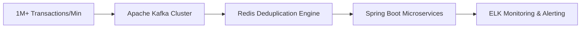

# Udhav Mohata
### Senior Software Development Engineer | Data Infrastructure & AI Systems
📍 Bengaluru, India | 📧 uvmohata@gmail.com | 🔗 [LinkedIn](https://linkedin.com/in/udhavmohata) | 📄 [Download Resume](https://drive.google.com/file/d/1MPI9TQoWp-nSU6nG_56zR_cKIPf8gZ4M/view?usp=sharing)

I am a Senior Software Development Engineer with 5+ years of experience architecting high-scale distributed backends, streaming data pipelines, and modern data lakehouse infrastructures. I specialize in building fault-tolerant microservices capable of processing operational workloads of **1M+ transactions/minute** and engineering analytical layers that execute performant queries over **10+ TB datasets** under strict enterprise SLAs.

---

## 🛠️ Technical Ecosystem

| Layer | Technologies & Tools |
| :--- | :--- |
| **Languages & Frameworks** | Java (Modern Java 21, Virtual Threads), Python, Spring Boot, Kafka, Celery, LLM Orchestration |
| **Streaming & Data Processing** | Apache Kafka, Apache Iceberg, Trino, Distributed Data Pipelines |
| **Databases & Storage** | Iceberg, ClickHouse, Redis, MySQL, MongoDB, MariaDB, BigQuery |
| **Systems & Infrastructure** | Microservices Architecture, API Design, Data Pipelines, Docker, AWS, GCP, ELK Stack |

---

## 🏗️ Featured Production Architectures (Public Proof of Work)

### 1. MigrateSense 🤖 | AI-Driven Database Infrastructure Auditor
Built a two-stage LLM database migration auditor to detect complex schema and semantic contract drift.

* **The Problem:** Traditional CI/CD linters only catch syntax errors; they fail to recognize when a structural schema change breaks downstream data contracts or alters semantic meaning across distributed microservices.
* **Architectural Blueprint:** Engineered a two-stage analysis pipeline where Stage 1 executes strict structural schema validations, while Stage 2 leverages LLM orchestrations to validate data definitions against live service schemas, isolating subtle regressions and drift.
* **Key Focus:** Designed to act as a zero-friction infrastructure safety guard, heavily optimized for fast context matching and low semantic analysis latency.

---

### 2. Real-Time Logistics Alerting & Deduplication Engine ⚡ | High-Throughput Streaming Pipeline
Designed a high-throughput Kafka-based audit pipeline utilizing the ELK stack for real-time transactional monitoring.

* **Scale & Throughput:** Engineered high-concurrency microservices using Spring Boot and Kafka to handle an operational workload of 1M+ transactions/min under tight latency bounds.
* **Idempotency & Stability:** Built a Redis-based Kafka deduplication engine to ensure real-time inventory synchronization across marketplaces without message loss. Implemented custom Kafka rate-limiting and priority features to gracefully absorb volatile peak load events and preserve core system stability.
* **Observability:** Established monitoring and proactive alerting workflows using the ELK stack, cutting platform anomaly debugging times by 30%.

---

### 3. Distributed Data Lakehouse Analytics Core 📊 | High-Performance Storage
Architected a Data Lakehouse foundation to migrate legacy tabular storage spaces into a modern, query-optimized distributed engine.

* **Infrastructure Optimization:** Re-architected data footprints utilizing Apache Iceberg and ClickHouse, reducing structural ETL pipeline costs by 40% and driving a 3x acceleration in data availability for real-time analytics. Optimized overall cloud infrastructure costs by 40% through this successful analytical migration.
* **Strict SLA API Layer:** Led the end-to-end development of the Keyword Reporting backend microservices. Engineered analytical REST APIs utilizing Trino and ClickHouse as a distributed SQL engine to run complex calculations over 10+ TB datasets within a strict 5-second SLA, significantly reducing latency compared to legacy MariaDB systems.
* **Ingestion Framework:** Designed a robust data collection framework using Python and Redis that cut aggregate keyword data ingestion cycles in half (from 4 days down to 2 days) while maintaining a >95% pipeline reliability guarantee.

---

## 📈 System Metrics & Career Milestones
* **2x Yearly WOW Award:** Recognized for designing critical architectural interventions that resolved blocking platform stability and scale pain points under live production pressures.
* **Core API Efficiency:** Consistently deliver core REST APIs and store selection algorithms with data lookup response times <100ms and an 80% accuracy threshold for inventory trend prediction.

---

## 📬 Let's Connect
* **Email:** uvmohata@gmail.com
* **LinkedIn:** [linkedin.com/in/udhavmohata](https://linkedin.com/in/udhavmohata)
* **Resume:** [Access My Professional Resume (Google Drive)](https://drive.google.com/file/d/1MPI9TQoWp-nSU6nG_56zR_cKIPf8gZ4M/view?usp=sharing)
* **Portfolio Scope:** If you are an Engineering Manager or Talent Partner looking for system design expertise focused on high-scale backend services, data lakehouse design, or operational AI utilities, explore my repositories below.
